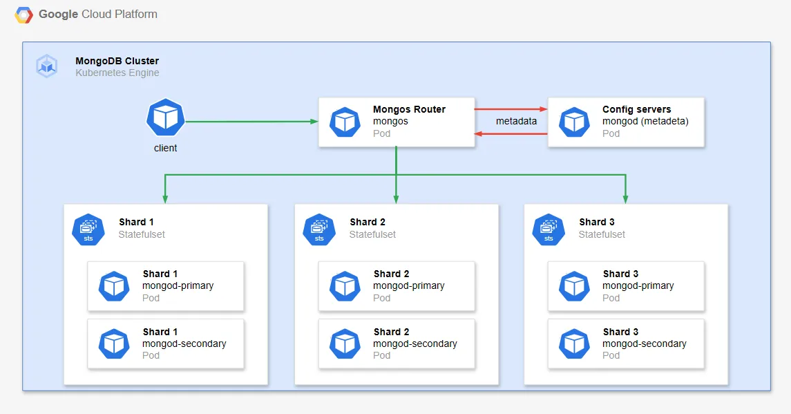

## gke-mongo-sharding-cluster
A demo for using sharding in MongoDB Cluster

### System Architecture

In this demo, we once again return to working with Kubernetes. The cluster has the following components:

- **Mongos Router**: This is the main entry point for client applications. `Mongos` receives queries from clients, analyzes them, and routes them to the appropriate shard based on the shard key. It doesn't store data but acts as an intermediary.
- **Config Servers**: Config servers store cluster metadata, including information about shards, sharding configuration, and how data is distributed. In this case, there is only 1 config server (typically in production environments there would be 3 to ensure high availability).
- **Shards**: Each shard is a replica set that stores a portion of the cluster's data. In this case, you have **3 shards** (shard0, shard1, shard2), each with 2 **replicas** (primary - secondary)
- **Headless Service**: Headless service is used to manage pods in StatefulSet (config servers and shards). It allows direct access to each pod through DNS.



**MongoDB Sharded Cluster Operation Flow**:

- **Client sends query** to mongos via the my-mongo-mongodb-sharded service (port 27017).
- **Mongos analyzes query**, looks up metadata from **config server** (my-mongo-mongodb-sharded-configsvr-0) to determine the shard containing the data.
- **Mongos routes query** to the appropriate shard (shard0, shard1, or shard2).
- **Shard processes query**, returns results to mongos.
- **Mongos aggregates results** (if needed) and sends them back to the client.

Here we use an additional technique compared to the previous two experiments, which is data sharding. **Sharding** is a strategy of horizontally partitioning data into multiple parts (shards), where each shard contains a subset of the data. Each shard can be stored on a physical node (or a group of nodes), and all shards combined form the complete dataset.

**Horizontal Partitioning**: each table is divided into segments (shards) containing different rows. For example:

- Partitioning user data by geographic region, ID range, or some other characteristic
- Each shard can be a separate database or schema, located on different servers.

Sharding techniques in MongoDB:

- **Range-based Sharding**: Data is divided into chunks based on the range of shard key values (e.g., user_id from 1-1000 in shard0, 1001-2000 in shard1). This approach is effective for range queries and ordered data but can become unbalanced if the shard key has uneven distribution (hot shards).
- **Hash-based Sharding**: Data is distributed based on the hash value of the shard key, ensuring random and even distribution. This method distributes data evenly, reducing the risk of hot shards, but is not efficient for range queries since hash values don't preserve the original order.
- **Tag-aware Sharding (Zone-based Sharding)**: Assign tags to shards to create zones, linking shard key ranges with zones to control data location (e.g., EU data stored in EU shard). This approach is optimal for geographic or legal requirements (like GDPR), reducing access latency but more complex, potentially causing imbalance if one zone has too much data.

When choosing a Shard Key, we need to consider the following factors:

- **High Cardinality**: Shard key should have many different values (e.g., user_id is better than gender) to avoid concentrating data in one shard.
- **Frequent Queries**: Choose a shard key that matches common queries so mongos can route efficiently (e.g., use region if querying by geographic area).
- **Even Distribution**: Avoid shard keys with concentrated values (like recent dates or repeating values) to prevent hot shards.
- **Immutable**: Shard key should not change after selection, as MongoDB doesn't easily support shard key updates.
- **Combination with tag-aware**: If using tag-aware sharding, choose a shard key that supports zone partitioning (like country or region).
- **Performance Testing**: Test with sample data to ensure the shard key doesn't cause scatter-gather queries (queries hitting all shards)

### Installation and Testing

Create GKE cluster

```bash
gcloud container clusters create $CLUSTER_NAME \
    --num-nodes=3 \
    --machine-type=n1-standard-2 \
    --disk-size=60GB \
    --zone=$ZONE \
    --release-channel=regular

gcloud container clusters get-credentials $CLUSTER_NAME --zone $ZONE

# Verify
kubectl get nodes
```

Use helm chart to deploy a simple MongoDB Sharding cluster

```bash
helm repo add bitnami https://charts.bitnami.com/bitnami
helm repo update
helm install my-mongo bitnami/mongodb-sharded \
  --set shards=2 \
  --set shardsvr.dataNode.replicaCount=3 \
  --set auth.enabled=true \
  --set auth.rootPassword=mysecretpassword

## easy to scale with helm
helm upgrade my-mongo bitnami/mongodb-sharded \
  --namespace default \
  --set shards=3
```

Check installed objects

```bash
$ kubectl get all -n default
NAME                                                 READY   STATUS      RESTARTS   AGE
pod/mongo-client                                     0/1     Completed   0          61m
pod/my-mongo-mongodb-sharded-configsvr-0             1/1     Running     0          148m
pod/my-mongo-mongodb-sharded-mongos-75dd8994-wssbm   1/1     Running     0          148m
pod/my-mongo-mongodb-sharded-shard0-data-0           1/1     Running     0          148m
pod/my-mongo-mongodb-sharded-shard0-data-1           1/1     Running     0          115m
pod/my-mongo-mongodb-sharded-shard1-data-0           1/1     Running     0          148m
pod/my-mongo-mongodb-sharded-shard1-data-1           1/1     Running     0          115m
pod/my-mongo-mongodb-sharded-shard2-data-0           1/1     Running     0          115m
pod/my-mongo-mongodb-sharded-shard2-data-1           0/1     Pending     0          115m

NAME                                        TYPE        CLUSTER-IP      EXTERNAL-IP   PORT(S)     AGE
service/kubernetes                          ClusterIP   34.118.224.1    <none>        443/TCP     175m
service/my-mongo-mongodb-sharded            ClusterIP   34.118.235.89   <none>        27017/TCP   148m
service/my-mongo-mongodb-sharded-headless   ClusterIP   None            <none>        27017/TCP   148m

NAME                                              READY   UP-TO-DATE   AVAILABLE   AGE
deployment.apps/my-mongo-mongodb-sharded-mongos   1/1     1            1           148m

NAME                                                       DESIRED   CURRENT   READY   AGE
replicaset.apps/my-mongo-mongodb-sharded-mongos-75dd8994   1         1         1       148m

NAME                                                    READY   AGE
statefulset.apps/my-mongo-mongodb-sharded-configsvr     1/1     148m
statefulset.apps/my-mongo-mongodb-sharded-shard0-data   2/2     148m
statefulset.apps/my-mongo-mongodb-sharded-shard1-data   2/2     148m
statefulset.apps/my-mongo-mongodb-sharded-shard2-data   1/2     115m
```

Connect to MongoDB cluster

```bash
kubectl run -it --rm mongo-client --image=docker.io/bitnami/mongodb-sharded:8.0.8-debian-12-r0 --restart=Never -- bash

@mongo-client:/$ mongosh admin --host my-mongo-mongodb-sharded.default.svc.cluster.local --authenticationDatabase admin -u root -p mysecretpassword
[direct: mongos] admin>
```

### Demo: Sharding

**a. Create database and configure sharding**

As we installed above, we currently have 3 shards to store data. With these shards, we will implement different sharding strategies in the context of deploying a database for an online shopping website, with three collections: **orders, users, posts.** Where:

- Collection `users` will implement Hashed sharding with the goal of evenly distributing users.
- Collection `posts` stores posts by time range across different shards using Ranged sharding
- Collection `orders` stores orders and uses sharding combined with both Ranged sharding for the `order_date` attribute and Zone sharding based on region

Enter the mongo admin shell, create database `use social_db`. Then create hashed sharding for `users`. The data will be randomly distributed across shards (shard-0, shard-1, shard-2) based on the hash value of _id.

```bash
sh.shardCollection("social_db.users", { "_id": "hashed" })
```

Next, we create **Ranged sharding** for posts with range definitions

- Sharding command
    
    ```bash
    sh.shardCollection("social_db.posts", { "created_at": 1 })
    ```
    
- Check default chunk distribution
    
    ```bash
    sh.status()
    ```
    
- Move chunks to desired shard
    
    ```bash
    sh.moveChunk("social_db.posts", { "created_at": MinKey }, "my-mongo-mongodb-sharded-shard-0")
    sh.moveChunk("social_db.posts", { "created_at": ISODate("2023-01-01T00:00:00Z") }, "my-mongo-mongodb-sharded-shard-1")
    sh.moveChunk("social_db.posts", { "created_at": ISODate("2024-01-01T00:00:00Z") }, "my-mongo-mongodb-sharded-shard-2")
    ```
    

Finally, we will create Zone sharding combined with Ranged sharding for the orders collection with combined shard key `{ "region": 1, "order_date": 1 }` to support zone sharding based on region. Then configure:

- shard-0 (tag "EU"): Store all orders in the EU region.
- shard-1 (tag "US"): Store US orders until the end of 2023.
- shard-2 (tag "US"): Store US orders from 2024 to present.

Sharding command

```bash
sh.shardCollection("social_db.orders", { "region": 1, "order_date": 1 })
```

Then attach shards to zones

```bash
sh.addShardToZone("my-mongo-mongodb-sharded-shard-0", "EU")
sh.addShardToZone("my-mongo-mongodb-sharded-shard-1", "US")
sh.addShardToZone("my-mongo-mongodb-sharded-shard-2", "US")
```

**Define tag ranges**:

- Zone "EU" (for shard-0):
    
    ```bash
    sh.addTagRange(
      "social_db.orders",
      { "region": "EU", "order_date": MinKey },
      { "region": "EU", "order_date": MaxKey },
      "EU"
    )
    ```
    
- Zone "US" until 2023 (for shard-1):
    
    ```bash
    sh.addTagRange(
      "social_db.orders",
      { "region": "US", "order_date": MinKey },
      { "region": "US", "order_date": ISODate("2024-01-01T00:00:00Z") },
      "US"
    )
    ```
    
- Zone "US" from 2024 (for shard-2):
    
    ```bash
    sh.addTagRange(
      "social_db.orders",
      { "region": "US", "order_date": ISODate("2024-01-01T00:00:00Z") },
      { "region": "US", "order_date": MaxKey },
      "US"
    )
    ```

**Moving chunks and delete unnecessary chunks**

```bash
// Move EU chunks to shard-0 (should already be correct, but ensure)
sh.moveChunk("social_db.orders", { "region": "EU", "order_date": MinKey }, "my-mongo-mongodb-sharded-shard-0")
sh.moveChunk("social_db.orders", { "region": "EU", "order_date": ISODate("2023-01-01T00:00:00Z") }, "my-mongo-mongodb-sharded-shard-0")

// Move US pre-2024 chunks to shard-1
sh.moveChunk("social_db.orders", { "region": "US", "order_date": MinKey }, "my-mongo-mongodb-sharded-shard-1")
sh.moveChunk("social_db.orders", { "region": "US", "order_date": ISODate("2023-06-01T00:00:00Z") }, "my-mongo-mongodb-sharded-shard-1")

// Move US 2024+ chunks to shard-2
sh.moveChunk("social_db.orders", { "region": "US", "order_date": ISODate("2024-01-01T00:00:00Z") }, "my-mongo-mongodb-sharded-shard-2")

// Remove unnecessary ones
sh.moveChunk("social_db.orders", { "region": MinKey(), "order_date": MinKey() }, "my-mongo-mongodb-sharded-shard-2")
sh.moveChunk("social_db.orders", { "region": "EU", "order_date": MaxKey() }, "my-mongo-mongodb-sharded-shard-2")
sh.moveChunk("social_db.orders", { "region": "US", "order_date": MaxKey() }, "my-mongo-mongodb-sharded-shard-2")
```

**b. Run test and check results**

```bash
[direct: mongos] social_db> for (var i = 0; i < 100; i++) {
...   db.users.insertOne({ name: "user" + i })
... }
<SNIP>
---
Totals
{
  data: '3KiB',
  docs: 100,
  chunks: 3,
  'Shard my-mongo-mongodb-sharded-shard-1': [
    '30.02 % data',
    '30 % docs in cluster',
    '38B avg obj size on shard'
  ],
  'Shard my-mongo-mongodb-sharded-shard-2': [
    '34.98 % data',
    '35 % docs in cluster',
    '38B avg obj size on shard'
  ],
  'Shard my-mongo-mongodb-sharded-shard-0': [
    '34.98 % data',
    '35 % docs in cluster',
    '38B avg obj size on shard'
  ]
}
```

```bash
[direct: mongos] social_db> db.posts.insertMany([
...   { content: "post1", created_at: ISODate("2022-12-01T00:00:00Z") },
...   { content: "post2", created_at: ISODate("2023-06-01T00:00:00Z") },
...   { content: "post3", created_at: ISODate("2024-02-01T00:00:00Z") },
...   { content: "post4", created_at: ISODate("2024-03-01T00:00:00Z") },
...   { content: "post5", created_at: ISODate("2024-04-01T00:00:00Z") }
... ])
...
{
  acknowledged: true,
  insertedIds: {
    '0': ObjectId('680788ff1b87915156d86244'),
    '1': ObjectId('680788ff1b87915156d86245'),
    '2': ObjectId('680788ff1b87915156d86246'),
    '3': ObjectId('680788ff1b87915156d86247'),
    '4': ObjectId('680788ff1b87915156d86248')
  }
}
[direct: mongos] social_db> db.posts.getShardDistribution()
Shard my-mongo-mongodb-sharded-shard-1 
{
  data: '61B',
  docs: 1,
  chunks: 1,
  'estimated data per chunk': '61B',
  'estimated docs per chunk': 1
}
---
Shard my-mongo-mongodb-sharded-shard-0 {
  data: '61B',
  docs: 1,
  chunks: 1,
  'estimated data per chunk': '61B',
  'estimated docs per chunk': 1
}
---
Shard my-mongo-mongodb-sharded-shard-2
{
  data: '183B',
  docs: 3,
  chunks: 1,
  'estimated data per chunk': '183B',
  'estimated docs per chunk': 3
}
---
Totals
{
  data: '305B',
  docs: 5,
  chunks: 3,
  'Shard my-mongo-mongodb-sharded-shard-1': [ '20 % data', '20 % docs in cluster'],
  'Shard my-mongo-mongodb-sharded-shard-0': [ '20 % data', '20 % docs in cluster'],
  'Shard my-mongo-mongodb-sharded-shard-2': [ '60 % data', '60 % docs in cluster']
}
```

```bash
[direct: mongos] social_db> db.orders.insertMany([
...   { order_id: 1, region: "EU", order_date: ISODate("2023-01-01T00:00:00Z") },
...   { order_id: 2, region: "US", order_date: ISODate("2023-06-01T00:00:00Z") },
...   { order_id: 3, region: "US", order_date: ISODate("2024-02-01T00:00:00Z") },
...   { order_id: 4, region: "US", order_date: ISODate("2025-02-01T00:00:00Z") },
...   { order_id: 5, region: "US", order_date: ISODate("2023-12-12T00:00:00Z") }
... ])
{
  acknowledged: true,
  insertedIds: {
    '0': ObjectId('68078eca1b87915156d86258'),
    '1': ObjectId('68078eca1b87915156d86259'),
    '2': ObjectId('68078eca1b87915156d8625a'),
    '3': ObjectId('68078eca1b87915156d8625b'),
    '4': ObjectId('68078eca1b87915156d8625c')
  }
}
[direct: mongos] social_db> db.orders.getShardDistribution()
Shard my-mongo-mongodb-sharded-shard-1
{
  data: '142B',
  docs: 2,
  chunks: 1,
  'estimated data per chunk': '142B',
  'estimated docs per chunk': 2
}
---
Shard my-mongo-mongodb-sharded-shard-2 
{
  data: '142B',
  docs: 2,
  chunks: 4,
  'estimated data per chunk': '35B',
  'estimated docs per chunk': 0
}
---
Shard my-mongo-mongodb-sharded-shard-0 {
  data: '71B',
  docs: 1,
  chunks: 1,
  'estimated data per chunk': '71B',
  'estimated docs per chunk': 1
}
---
Totals
{
  data: '355B',
  docs: 5,
  chunks: 6,
  'Shard my-mongo-mongodb-sharded-shard-1': [ '40 % data', '40 % docs in cluster'],
  'Shard my-mongo-mongodb-sharded-shard-2': [ '40 % data', '40 % docs in cluster'],
  'Shard my-mongo-mongodb-sharded-shard-0': [ '20 % data', '20 % docs in cluster']
}
```